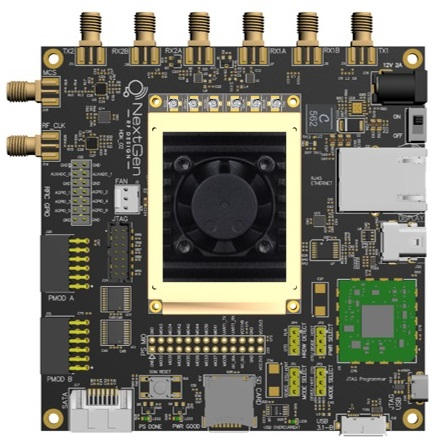
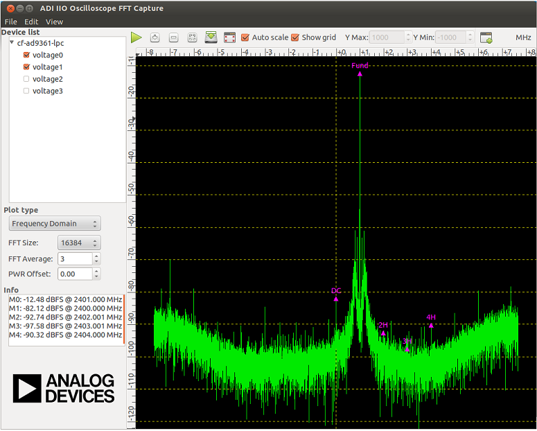

---

# NGRF IIO-Oscilloscope
This repo contains items necessary to run Analog Devices IIO-Oscilloscope on supported NextGenRF Design Hardware.  This includes the BytePipe_x9002 SOM shown below.

The IIO-Oscilloscope application developed by Analog Devices is a cross platform GUI application for capturing and plotting time domain, frequency domain, constellation, and cross-correlation data.  The application is designed to demonstrate the performance of Analog Devices evaluation boards.  This repository adds support for the BytePipe_x9002 SOM and other NextGenRF Design Hardware platforms.  The PC software can be downloaded from the releases tab [here](https://github.com/analogdevicesinc/iio-oscilloscope/releases).

## Documents

|  Document                                         | Description                               |
|---------------------------------------------------|-------------------------------------------|
| [Quick Start](docs/QuickStart.md)            	    | IIO Oscilloscope Quick Start Guide        |
| [Device Programming](docs/Programming.md)         | Programming hardware device with image    |
| [Hardware](docs/Hardware.md)            	        | Supported Hardware                        |
| [Build Environment](docs/BuildEnv.md)             | Build Environment                         |
| [Building HDL](docs/BuildingHdl.md)               | Building HDL from source                  |
| [Building Application](docs/BuildingLinux.md)     | Building application from source          |     
| [Update Profile/Stream](docs/UpdateProfiles.md)   | Update device stream and profile          |
| [DPD](docs/dpd.md)                                | Digital Pre-distortion                    |

