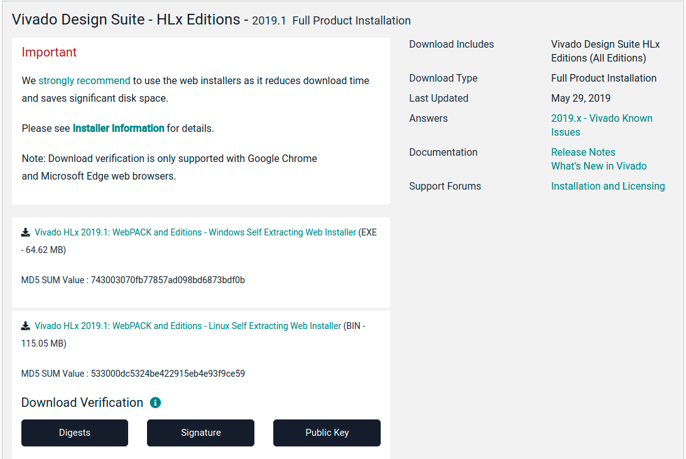

# Build Environment 

This document describes the build environment for building the source of IIO-Oscilloscope.
# Host PC

##  Resources

  The following list the minimum recommended workstation requirements:
  - 8 GB RAM (recommended minimum for Xilinx® tools)
  - 2 GHz CPU clock or equivalent (minimum of 8 cores)
  - 100 GB free HDD space
  - Supported OS:
      - Red Hat Enterprise Workstation/Server 7.4, 7.5, 7.6 (64-bit)
      - CentOS Workstation/Server 7.4, 7.5, 7.6 (64-bit)
      - Ubuntu Linux Workstation/Server 16.04.5, 16.04.6, 18.04.1,18.04.02 (64-bit)
- Root access to install PetaLinux dependencies
- Bash shell
- Xilinx account (to perform downloads)

## Linux

[Ubuntu 18.04.4](http://old-releases.ubuntu.com/releases/18.04.4/ubuntu-18.04-desktop-amd64.iso) is used for the host PC operating system.

* Download ISO image
* Create bootable USB drive using [Rufus](https://rufus.ie/) 

See additional information [here](https://ubuntu.com/tutorials/create-a-usb-stick-on-windows#1-overview).

## Tools

The following tools should be installed.

```
sudo apt install git
sudo apt-get install build-essential
sudo apt-get install u-boot-tools 
sudo apt install snapd
sudo snap install barrier
```

# Vivado

To build the HDL Vivado 2019.1 must be downloaded and installed from [here](https://www.xilinx.com/support/download/index.html/content/xilinx/en/downloadNav/vivado-design-tools/archive.html).  



Once downloaded execute the following bash commands. It is important not to install with sudo.

```bash
cd Downloads/
sudo chmod +x Xilinx_Vivado_SDK_Web_2019.1_0524_1430_Lin64.bin
./Xilinx_Vivado_SDK_Web_2019.1_0524_1430_Lin64.bin
```
# Petalinux
This document describes the process to install Xilinx PetaLinux tools.

PetaLinux dependency installation can be performed using the script `petatepinstall.sh` contained in thus repo, directory `scripts`. 

# Installation Steps
The following steps are preformed on a Linux machine, either a VM or a normal machine.

1. Download [PetaLinux 2019.2](https://www.xilinx.com/support/download/index.html/content/xilinx/en/downloadNav/embedded-design-tools/2019-2.html).  It is 8GB, it will be a while.
2. Install PetaLinux dependencies using `petatepinstall.sh` or manually as detailed [below](#manual-petalinux-dependency-installation)
3. Once the PetaLinux installer download has completed and the dependencies are installed, PetaLinux can be installed.
4. In a Bash make the installer executable: `chmod +x petalinux-v2019.2-final-installer.run`
5. Run PetaLinux installer as standard user: `./petalinux-v2019.2-final-installer.run`.  This is sample output from installing PetaLinux

```shell
ngrf@ubuntu:~/Downloads$ ./petalinux-v2019.2-final-installer.run /home/ngrf/petalinux
INFO: Checking installation environment requirements...
INFO: Checking free disk space                                                                                                
INFO: Checking installed tools                                                                                                
INFO: Checking installed development libraries                                                                                
INFO: Checking network and other services                                                                                     
WARNING: No tftp server found - please refer to "PetaLinux SDK Installation Guide" for its impact and solution                
INFO: Checking installer checksum...                                                                                          
INFO: Extracting PetaLinux installer...                                                                                                                                                                                                                                                             
LICENSE AGREEMENTS                                                                                                                                       

PetaLinux SDK contains software from a number of sources.  Please review
the following licenses and indicate your acceptance of each to continue.

You do not have to accept the licenses, however if you do not then you may 
not use PetaLinux SDK.

Use PgUp/PgDn to navigate the license viewer, and press 'q' to close

Press Enter to display the license agreements
Do you accept Xilinx End User License Agreement? [y/N] > y
Do you accept Webtalk Terms and Conditions? [y/N] > y
Do you accept Third Party End User License Agreement? [y/N] > y
INFO: Installing PetaLinux...
INFO: Checking PetaLinux installer integrity...
INFO: Installing PetaLinux SDK to "/home/ngrf/petalinux/."
INFO: Installing aarch64 Yocto SDK to "/home/ngrf/petalinux/./components/yocto/source/aarch64"...
INFO: Installing arm Yocto SDK to "/home/ngrf/petalinux/./components/yocto/source/arm"...
INFO: Installing microblaze_full Yocto SDK to "/home/ngrf/petalinux/./components/yocto/source/microblaze_full"...
INFO: Installing microblaze_lite Yocto SDK to "/home/ngrf/petalinux/./components/yocto/source/microblaze_lite"...
INFO: PetaLinux SDK has been installed to /home/ngrf/petalinux/.

```
6. Ensure shell is using Bash: `sudo dpkg-reconfigure dash`.  Select **no** when prompted.  You should see output like this
```shell
ngrf@ubuntu:~/petalinux$ sudo dpkg-reconfigure dash
Removing 'diversion of /bin/sh to /bin/sh.distrib by dash'
Adding 'diversion of /bin/sh to /bin/sh.distrib by bash'
Removing 'diversion of /usr/share/man/man1/sh.1.gz to /usr/share/man/man1/sh.distrib.1.gz by dash'
Adding 'diversion of /usr/share/man/man1/sh.1.gz to /usr/share/man/man1/sh.distrib.1.gz by bash'

```
## Manual PetaLinux Dependency Installation

```bash
sudo apt-get -y install tofrodos \
    iproute2 \
    gawk \
    make \
    net-tools \
    libncurses5-dev \
    tftpd \
    zlib1g:i386 \
    libssl-dev \
    flex \
    bison \
    libselinux1 \
    gnupg \
    wget \
    diffstat \
    chrpath \
    socat \
    xterm \
    autoconf \
    libtool \
    tar \
    unzip \
    texinfo \
    zlib1g-dev \
    gcc-multilib \
    build-essential \
    screen \
    pax \
    gzip

    sudo apt install python-minimal
    sudo apt-get install -y xvfb
    sudo apt-get install libsdl1.2-dev
    sudo apt-get install libglib2.0-dev
```


### Disclaimer
----------------------
NextGen RF Design makes no warranty for the use of this code or design. This code is provided  "As Is". NextGen RF Design assumes no responsibility for
any errors, which may appear in this code, nor does it make a commitment to update the information contained herein. NextGen RF Design specifically
disclaims any implied warranties of fitness for a particular purpose.
Copyright(c) NextGen RF Design
All rights reserved.

