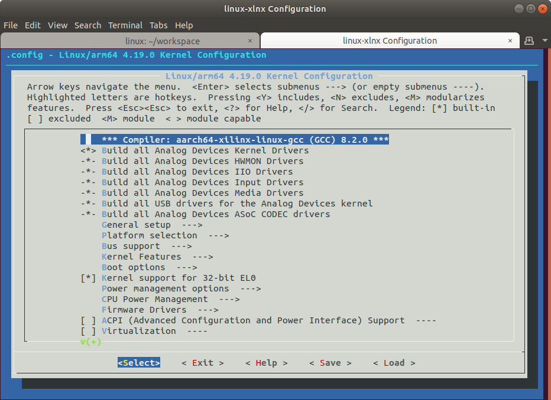
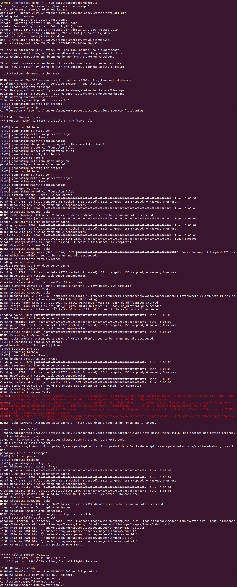

---

# Building Application
This document details the building of IIO-Oscilloscope application running on the device.  If you are reading this then it is likely you have cloned the NextGenRF Design IIO-Oscilloscope from [here](https://github.com/NextGenRF-Design-Inc/iio-oscilloscope.git). If not please clone this repository to your local Linux Machine.

```bash
git clone https://github.com/NextGenRF-Design-Inc/iio-oscilloscope.git
```

# Create Workspace

Next create a workspace folder.  This can be created anywhere and can be deleted once the build is done. 

```bash
mkdir workspace
cd workspace
```

# Board Support Package

Before the Linux Application can be built a board support package must be generated.  Petalinux can create the board support package from a hardware definition file.  The hardware definition file is an output of the HDL build.  The latest released hardware definition file [here](https://github.com/NextGenRF-Design-Inc/iio-oscilloscope/releases) can be used if there are no significant changes between the previous released version and the master branch.  Otherwise the HDL should be built from source.  To build the HDL from source see [Building HDL](BuildingHdl.mdl).  

In either case to build the application a system.hdf must be placed at the top level of the workspace.  Petalinux will use this to create the board support package used by the application and linux kernel.

# Build Script

The application, bsp, boot-loader, and all necessary files are built using a single build script  The script fetches the latest sources from Analog Devices and Xilinx and compiles the source code for NextGenRF Design hardware platforms.  

Before executing the script the Petalinux environment path must be setup as shown below. 

```bash
source ~/tools/Xilinx/petalinux/2019.1/settings.sh
```

The next step is to run the build script.  The application build script is located in the app folder `iio-oscilloscope/app`.  The preferred method is to run this script from within the workspace directory as shown below.  

```bash
make -f ~/iio-oscilloscope/app/Makefile
``` 

The script starts by fetching the necessary source code and creating a Petalinux project.  Once the project is created a configuration menu will come up.   Navigate to Yocto Settings→User layers and add the following. 

`~/workspace/meta-adi/meta-adi-core`
`~/workspace/meta-adi/meta-adi-xilinx`

**_Note - Since meta-adi-xilinx depends on meta-adi-core, it has to be included after meta-adi-core. The order is important!_**


Once the Petalinux configuration has been done the script launches a `menuconfig` allowing the user to configure the Linux Kernel.  Currently no kernel customization is required and the menu can simply be exited.



Once the project and kernel has been configured the script will setup the appropriate device tree and execute a `petalinux-build`.  You may notice from the terminal a few errors as shown below, this is normal.
The build script must start the build, let it fail, copy additional device tree files, and then re-build.  This is all done automatically by the script, if no additional errors beyond what is shown below are observed then the build has finished successfully.



When the source has finished building a boot image is created.  The BOOT.BIN file encapsulates the first stage bootloader, FPGA binary, platform management unit, ARM trusted firmware, and UBOOT.  This is all done by the script.  The resulting build outputs are then copied from the build directory to the top of workspace.  These files can be copied to the SD card.  See [Device Programming](Programming.md) which describes flashing the SD card with the correct partitions and file system.