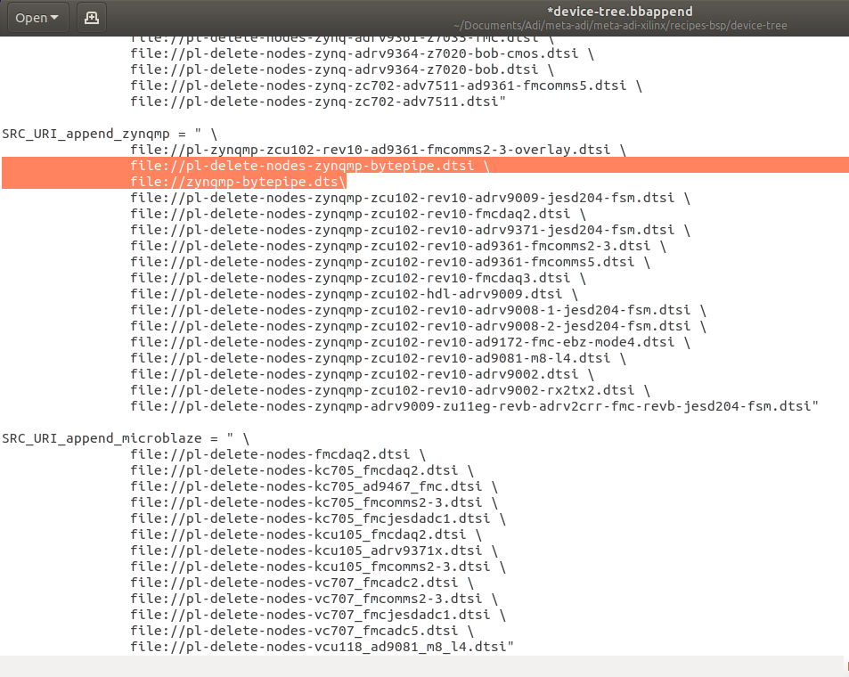

---

# Building Application
This document details the building of IIO-Oscilloscope application running on the device.  If you are reading this then it is likely you have cloned the NextGenRF Design IIO-Oscilloscope from [here](https://github.com/NextGenRF-Design-Inc/iio-oscilloscope.git). If not please clone this repository to your local Linux Machine.

```bash
git clone https://github.com/NextGenRF-Design-Inc/iio-oscilloscope.git
```

# Create Workspace

Next create a workspace folder.  This can be created anywhere and can be deleted once the build is done. 

```bash
mkdir workspace
cd workspace
```

# Board Support Package

Before the Linux Application can be built a board support package must be generated.  Petalinux can create the board support package from a hardware definition file.  The hardware definition file is an output of the HDL build.  A pre-built hardware definition file can used or the HDL can be built from source.  To build the HDL from source see [Building HDL](BuildingHdl.mdl).  

To use a pre-built hardware definition file you simply need to copy it to the workspace folder and point Petalinux to it.  The IIO-Oscilloscope repo contains a pre-built hardware definition file and it can be copied using the following command. 

```bash
cp ~/iio-oscilloscope/hdl/bytepipe_3cg_9002/system.hdf ./
```

# Meta-ADI

This step downloads Analog Devices Linux platform layer.  More information about the ADI Yocoto layer can be found [here](https://github.com/analogdevicesinc/meta-adi/tree/master/meta-adi-xilinx).

```bash
git clone --branch 2019_R2 https://github.com/analogdevicesinc/meta-adi.git
```
# Create Petalinux Project

This step creates a Petalinux project called iioscope.

```bash
source ~/tools/Xilinx/petalinux/2019.1/settings.sh
petalinux-create -t project --template zynqMP --name iioscope
cd iioscope/
```

# Kernel Configuration

Next the kernel must be configured with the appropriate settings.  This is done by through the `MenuConfig`.

```bash
petalinux-config --get-hw-description=~/workspace/
```

When running petalinux-config, a configuration menu will come up. Go to Yocto Settings→User layers and add the following. 

`~/workspace/meta-adi/meta-adi-core`
`~/workspace/meta-adi/meta-adi-xilinx`

**_Note - Since meta-adi-xilinx depends on meta-adi-core, it has to be included after meta-adi-core. The order is important!_**


# Device Configuration
Next the device tree must be configured and the kernel built.  

Start by copying the device tree files to meta-adi-xilnx/recipies-bsp/device-tree/files/. 

```bash
cp ~/iio-oscilloscope/dts/zynqmp-bytepipe.dts ~/workspace/meta-adi/meta-adi-xilinx/recipes-bsp/device-tree/files/
cp ~/iio-oscilloscope/dts/pl-delete-nodes-zynqmp-bytepipe.dtsi ~/workspace/meta-adi/meta-adi-xilinx/recipes-bsp/device-tree/files/
```

Next open device-tree.bbappend and add the BytePipe device tree.  The file can be opened using gedit as shown below.

```bash
gedit ~/workspace/meta-adi/meta-adi-xilinx/recipes-bsp/device-tree/device-tree.bbappend
```

Manually add the following lines under `SRC_URI_append_zynqmp`.

```
file://pl-delete-nodes-zynqmp-bytepipe.dtsi \
file://zynqmp-bytepipe.dts \
```

This is shown below.



Next update the configuration file to build with the bytepipe device tree.  

```bash
echo "KERNEL_DTB=\"zynqmp-bytepipe\"" >> project-spec/meta-user/conf/petalinuxbsp.conf
```

# Build the Kernel
With the configuration as desired the kernel may now be built with the following command.

```bash
petalinux-build
```

The initial Kernel build will fail indicating the device tree cannot be found.  To fix enter the following command and rebuild.

```bash
cp ~/iio-oscilloscope/dts/zynqmp-bytepipe.dts ~/workspace/iioscope/build/tmp/work-shared/plnx-zynqmp/kernel-source/arch/arm64/boot/dts/xilinx/
petalinux-build
```

# Package Boot Files

Once the kernel is built a BOOT.BIN file must be created which encapsulates the first stage bootloader, FPGA binary, platform management unit, ARM trusted firmware, and UBOOT.  This is done with the following command.

```bash
cd ~/workspace/iioscope/images/linux/
petalinux-package --boot --fsbl zynqmp_fsbl.elf --fpga system.bit --pmufw pmufw.elf --atf bl31.elf --u-boot u-boot.elf 
```

# Flash SD Card

See [Device Programming](Programming.md) which describes flashing the SD card with the correct partitions and file system.  Once this is done the previously built images can be copied to the SD card.

```bash
cp ~/workspace/iioscope/images/linux/image.ub /media/username/BOOT/
cp ~/workspace/iioscope/images/linux/BOOT.BIN /media/username/BOOT/
cp ~/workspace/iioscope/images/linux/system.dtb /media/username/BOOT/
```