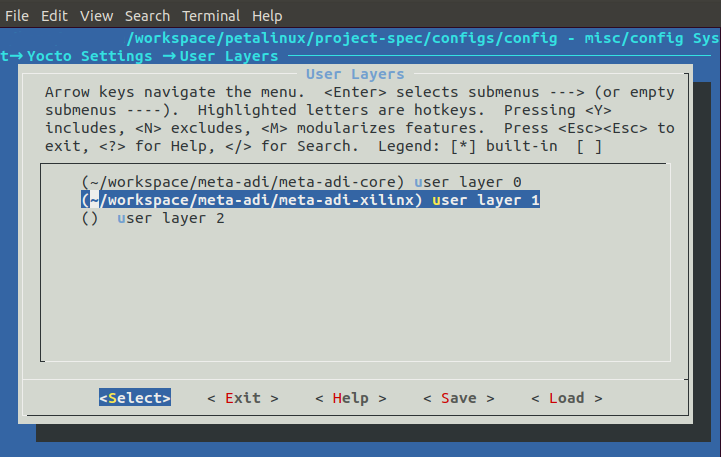
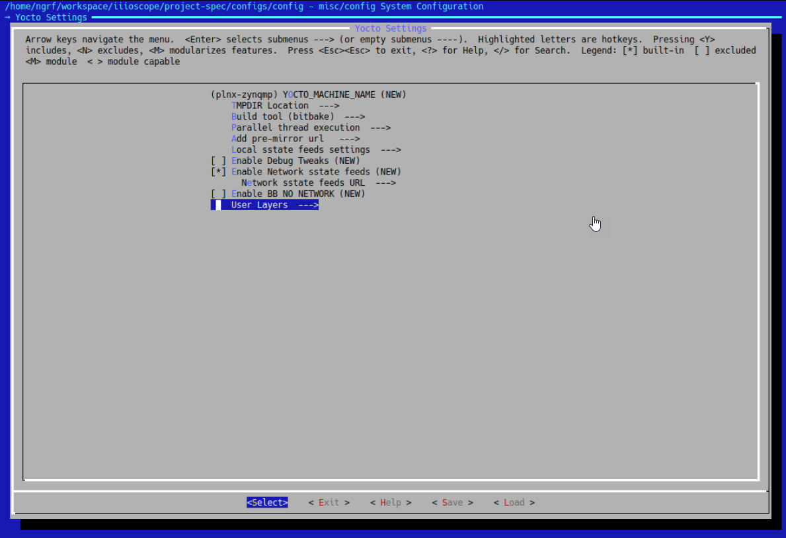
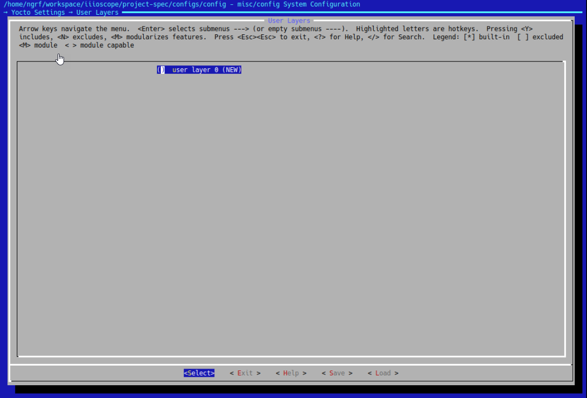
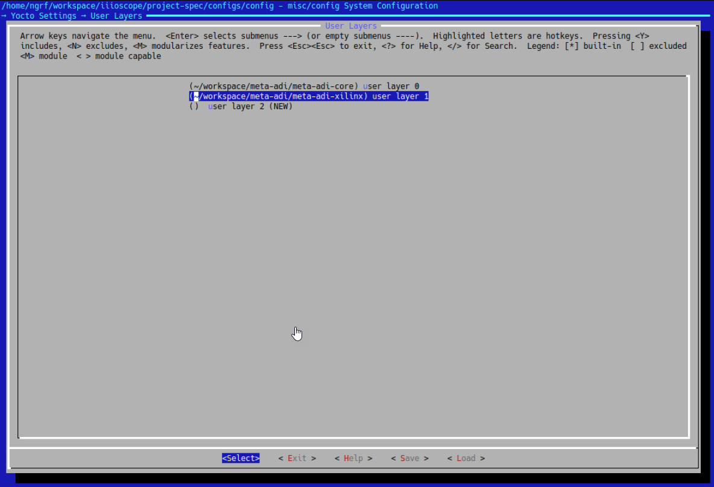

---

# Building Application
This document details the building of IIO-Oscilloscope application running on the device.  If you are reading this then it is likely you have cloned the NextGenRF Design IIO-Oscilloscope from [here](https://github.com/NextGenRF-Design-Inc/iio-oscilloscope.git). If not please clone this repository to your local Linux Machine.

```bash
git clone https://github.com/NextGenRF-Design-Inc/iio-oscilloscope.git
```

# Create Workspace

Next create a workspace folder.  This can be created anywhere and can be deleted once the build is done. 

```bash
mkdir workspace
cd workspace
```

# Meta-ADI

This step downloads Analog Devices Linux platform layer.  More information about the ADI Yocoto layer can be found [here](https://github.com/analogdevicesinc/meta-adi/tree/master/meta-adi-xilinx).

```bash
cd ~/workspace
git clone --branch 2019_R2 https://github.com/analogdevicesinc/meta-adi.git
```
# Create Petalinux Project

This step creates a Petalinux project called iioscope.

```bash
source ~/tools/Xilinx/petalinux/2019.1/settings.sh
petalinux-create -t project --template zynqMP --name iioscope
cd iioscope/
```

# Kernel Configuration

Next the kernel must be configured with the appropriate settings.  This is done by through the `MenuConfig`.

```bash
petalinux-config --get-hw-description=~/workspace/
```

When running petalinux-config, a configuration menu will come up. Go to Yocto Settings→User layers. 





Add the following user layers:

`~/workspace/meta-adi/meta-adi-core`

`~/workspace/meta-adi/meta-adi-xilinx`

**_Note - Since meta-adi-xilinx depends on meta-adi-core, it has to be included after meta-adi-core. The order is important!_**



Use the arrow keys to select `Save` and press the enter key.  A popup will be displayed informing where the settings will be saved; select `Ok` and press the enter key.  Then keep selecting `Exit` (and press the enter key) until you exit the menuconfig.  PetaLinx will proceed to create the configuration; this will take a while.

The following shows a typical output when successful.

```bash
ngrf@ubuntu:~/workspace/iiioscope$ petalinux-config --get-hw-description=~/workspace/
INFO: Getting hardware description...
[INFO] generating Kconfig for project
[INFO] menuconfig project


*** End of the configuration.
*** Execute 'make' to start the build or try 'make help'.

[INFO] sourcing bitbake
[INFO] generating plnxtool conf
[INFO] generating meta-plnx-generated layer
[INFO] generating user layers
[INFO] generating workspace directory
[INFO] generating machine configuration
[INFO] generating bbappends for project . This may take time ! 
[INFO] generating u-boot configuration files
[INFO] generating kernel configuration files
[INFO] generating kconfig for Rootfs
[INFO] silentconfig rootfs
[INFO] generating petalinux-user-image.bb
```

# Device Configuration
Next update the configuration file to build with the correct device tree.

```bash
echo "KERNEL_DTB=\"system-user\"" >> project-spec/meta-user/conf/petalinuxbsp.conf
```

# Build the Kernel
With the configuration as desired the kernel may now be built with the following command.

```bash
petalinux-build
```
