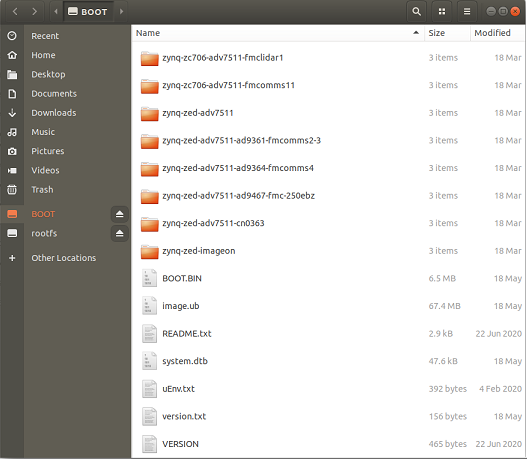

---
# Programming SD Card

The following instructions detail the steps required for programming a SD card with the IIO-Oscilloscope application for NextGenRF Design hardware platforms.  Additional information for non NextGenRF Design hardware platforms can be found on [here](https://swdownloads.analog.com/cse/kuiper/image_2021-07-28-ADI-Kuiper-full.zip).

# Formatting SD Card

Before the binaries can be loaded onto the SD card it must be formatted first.  This is easiest done by flashing the SD card with a previously known good image.  The latest pre-formatted linux image can be found from Analog Devices [here](https://swdownloads.analog.com/cse/kuiper/2021-02-23-ADI-Kuiper.img.xz).  Once downloaded it should be flashed using the following instructions depending on if your PC is running Linux or Windows:
- [Linux Hosts](https://wiki.analog.com/resources/tools-software/linux-software/zynq_images/linux_hosts)
- [Windows Hosts](https://wiki.analog.com/resources/tools-software/linux-software/zynq_images/windows_hosts)

Flashing of the SD card ensures the partitions and file system is setup correctly.  Once flashed there should be a FAT32 BOOT partition and EXT4 rootfs partition.  The rootfs partition contains the Linux file system.  The BOOT partition is used by the bootloader to load the necessary binaries and boot the Linux kernel.  Once the SD card has been formatted the next step is to load the latest binaries onto the boot partition.

# BOOT

The BOOT partition comes with the boot files for the various hardware platforms supported by Analog Devices.  In order for a specific hardware platform to boot properly the boot files must be copied from the respective subdirectory into the base directory.  These files include:

- Image
- BOOT.BIN
- system.dtb

For Analog Devices hardware platforms these files can be simply copied from the existing subdirectory up one directory to the top of the BOOT partition.  For NextGenRF Design hardware platforms the pre-built boot files can be copied from the latest release located [here](https://github.com/NextGenRF-Design-Inc/iio-oscilloscope/releases).  If compiling the software from source these files can be copied from your working directory to the BOOT partition directly.   

