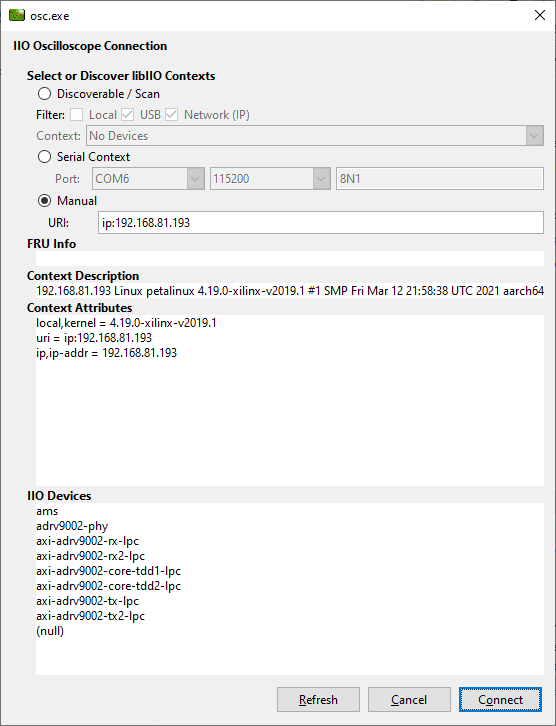
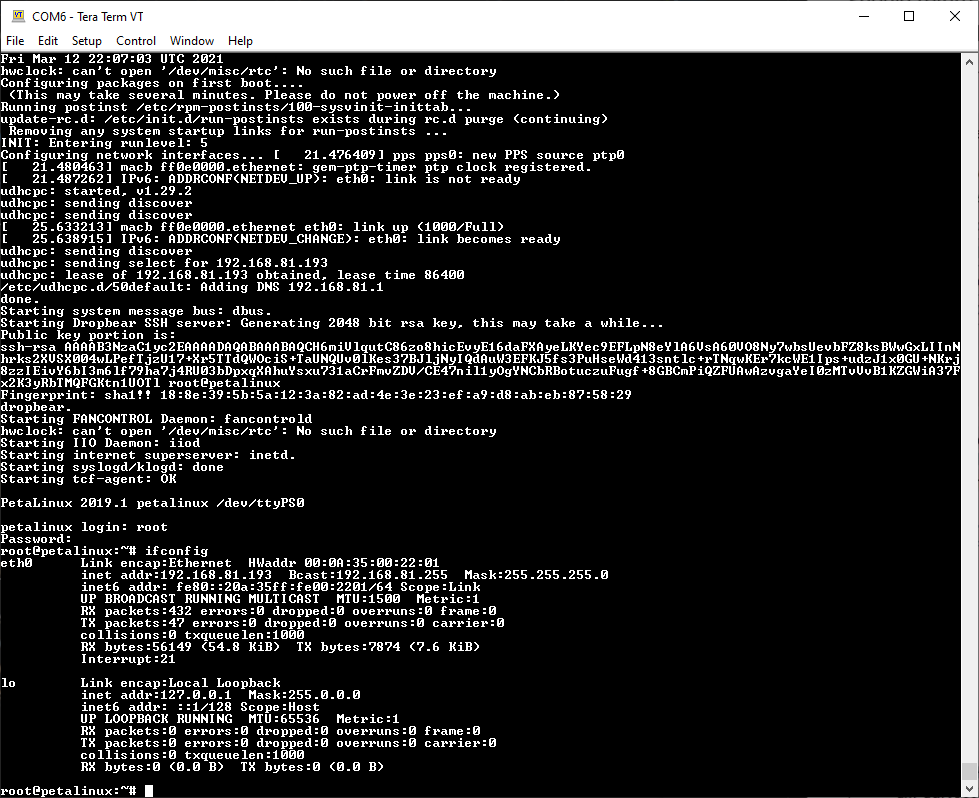
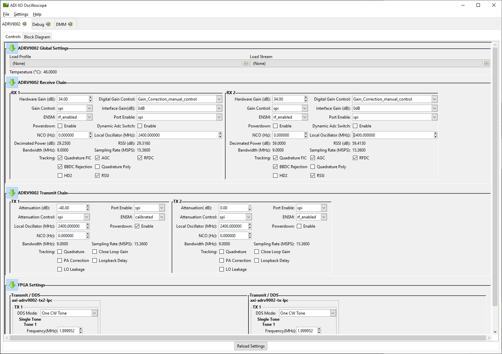
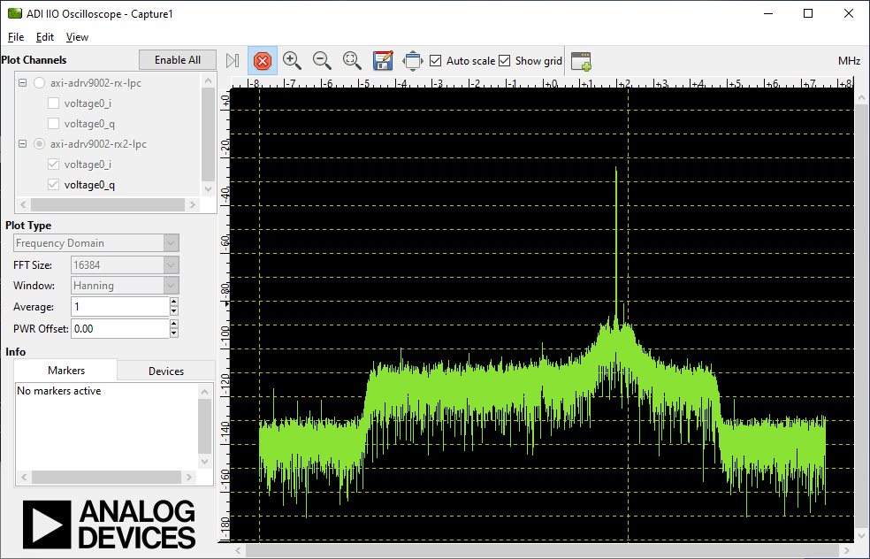

---

# Quick Start
This document gives a quick start guide for running IIO-Oscilloscope NextGenRF Design's Hardware.

# BytePipe_x9002 Hardware Development Kit (HDK)

The BytePipe_x9002 SOM needs a host board to provide power and connections for external communication.  These instructions assume the use of a NextGenRF Design Hardware Development Kit (HDK) in combination with the BytePipe_x9002 SOM. 

## Hardware Setup

The BytePipe_x9002 SOM should be plugged into the HDK taking care to properly align the board to board connections.  If the bottom side SMPM RF connections are used a SMPM blind adapter must be installed between each SMPM connector on the SOM and HDK. 
### Required Connections

  For additional information see [Hardware](Hardware.md).

- Power Switch: Ensure power switch on the HDK is in off position.
- Boot Switch:  Ensure the boot switch on the SOM is in the SD Card position.
- RF Adapters:  If SMPM board to board RF connections are used make sure to insert SMPM adapters between SOM and HDK.
- Mate the SOM to the HDK.
- SD Card: Insert a SD card formatted with the latest release build.  See [Device Programming](Programming.md)
- Fan: Connect the SOM fan into the HDK fan connection.
- Power Supply: Connect a 12V 24W power supply to the HDK power connector.
- Ethernet: Connect an ethernet cable to the ethernet port on the HDK.  This should be on the same network as PC running IIO-Oscilloscope.
- Serial Port:  Connect a USB2.0 Micro B cable to the programming port for serial access to the SOM.  
- RF Ports:  Connect RF ports to appropriate test instrumentation.

### Optional Connections

If running the IIO-Oscilloscope locally on the SOM a keyboard and mouse should be connected via an [OTG USB adapter](https://www.amazon.com/UGREEN-Adapter-Samsung-Controller-Smartphone/dp/B00LN3LQKQ/ref=sr_1_5?dchild=1&keywords=usb+otg+adapter&qid=1624389445&sr=8-5) using either a wireless keyboard and mouse or USB hub with wired keyboard and mouse.

In addition a display should be connected using a mini display port cable.  The display must natively support display port and no display port adapters should be used.  

# Launching IIO-Oscill0scope

Information for launching the IIO-Oscilloscope application locally or via a remote PC can be found [here](https://wiki.analog.com/resources/tools-software/linux-software/iio_oscilloscope).  The PC software can be downloaded from the releases tab [here](https://github.com/analogdevicesinc/iio-oscilloscope/releases).

Additional information about the ADRV9002 IIO plugin can be found [here](https://wiki.analog.com/resources/tools-software/linux-software/adrv9002_plugin) along with information regarding the ADRV9002 Linux driver can be found [here](https://wiki.analog.com/resources/tools-software/linux-drivers/iio-transceiver/adrv9002?&#tracking_calibrations).

## Connecting

With the SOM powered and connected to the local network launch the IIO-Oscilloscope application on a remote PC.  The first screen should be the connection screen as shown below.  To connect to the hardware select the manual connection method and input the ip address.  Once `Refresh` is pushed the device should return information about the build and available IIO devices.  Eight IIO Devices should be available as shown below.  

If the ip address of the device is unknown the serial port can be used to query the unit.  Using a terminal program connect to the serial port with settings 115200 8n1.  Once the device has booted login using username `root` and password `analog`.  To determine the ip address execute the command `ifconfig`.  

## Control

The control panel provides basic configuration of the IIO Devices.  Each receivers and transmitter can be enabled with basic functionality.  The FPGA settings provide transmit signal generation enabling basic waveforms along with providing the ability to load custom waveform files.

Note:

The default profile for  IIO-Oscilloscope uses LO1 for both receivers and LO2 for both transmitters.  As a result if you change the LO frequency for one of the transmitters it also changes the LO frequency for the other transmitter.  The same goes for the receivers.  This can be modified by generating and loading a new profile described [here](UpdateProfiles.md).  When uploading a new profile make sure the firmware installed in the device matches the profiles's interface (cmos or lvds).  

## Plot

The plot panel allows the received IQ signals to be plotted in either the time domain or frequency domain.  To enable plotting select the plot channels and push the play button.  

The plot below shows TX2 connected to RX2A using an external SMA cable and 20dB pad.  This plot was taken with the LNA enabled providing roughly 15dB of gain.  Additional information for enabling the LNA can be found [here](Hardware.md#LNA).

