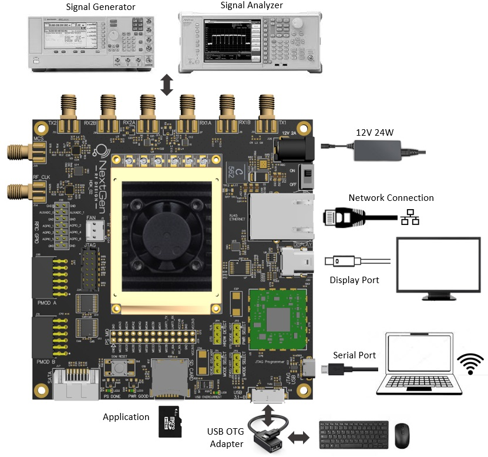

---

# Quick Start
This document gives a quick start guide for running IIO-Oscilloscope NextGenRF Design's Hardware.

## Table of Contents
- [Quick Start](#quick-start)
  - [Table of Contents](#table-of-contents)
- [BytePipe_x9002 Hardware Development Kit (HDK)](#bytepipe_x9002-hardware-development-kit-hdk)
  - [SOM/HDK Interconnect](#somhdk-interconnect)
  - [Fan](#fan)
  - [Power Supply](#power-supply)
  - [BOOT Switch](#boot-switch)
  - [SD Card](#sd-card)
  - [Ethernet Connection](#ethernet-connection)
  - [Serial Port](#serial-port)
  - [External Display](#external-display)
  - [KeyBoard/Mouse](#keyboardmouse)
- [ZCU102-ADRV9002](#zcu102-adrv9002)
- [Launching IIO-Oscilliscope](#launching-iio-oscilliscope)

# BytePipe_x9002 Hardware Development Kit (HDK)

The BytePipe_x9002 SOM needs a host board to provide power and connections for external communication.  These instructions assume the use of a NextGenRF Design Hardware Development Kit (HDK) in combination with the BytePipe_x9002 SOM. 

## SOM/HDK Interconnect

The BytePipe_x9002 SOM should be plugged into the HDK taking care to properly align the board to board connections.  If the bottom side SMPM RF connections are used a SMPM blind adapter must be installed between each SMPM connector on the SOM and HDK. 

## Fan

The fan which is connected to the SOM cover must be plugged into the HDK before powering the SOM.  Make sure the fan polarity is followed as shown below.

## Power Supply

With the power button turned to "off" connect a 12V 24W power supply as shown below.  Do not turn on power until everything is fully setup.

## BOOT Switch

Make sure the boot switch located on the bottom of the SOM is switched to SD as shown below.

## SD Card

Insert a SD card formatted with the latest release build.  See [Device Programming](docs/Programming.md) for additional information on formatting and 

## Ethernet Connection

Connect an ethernet cable to the ethernet port on the HDK.  The ethernet connection should be connected to a private network with DHCP enabled.  A PC shluld be connected to the same network using either ethernet or WiFi.

## Serial Port

Connect a USB2.0 Micro B cable to the programming port for serial access to the SOM from a PC.  

## External Display

If running IIO-Oscilloscope locally on the SOM a display should be connected using a mini display port cable.  The display must natively support display port and no display port adapters should be used.  

## KeyBoard/Mouse

If running the IIO-Oscilloscope locally on the SOM a keyboard and mouse should be connected via an [OTG USB adapter](https://www.amazon.com/UGREEN-Adapter-Samsung-Controller-Smartphone/dp/B00LN3LQKQ/ref=sr_1_5?dchild=1&keywords=usb+otg+adapter&qid=1624389445&sr=8-5) using either a wireless keyboard and mouse or USB hub with wired keyboard and mouse.

# ZCU102-ADRV9002

Information for setting up the ADRV9002 Zynq UltraScale+ MPSoC ZCU102 Evaluation hardware can be found [here](https://wiki.analog.com/resources/eval/user-guides/adrv9002/quickstart/zynqmp).

# Launching IIO-Oscilliscope

Information for launching the IIO-Oscilloscope application locally or via a remote PC can be found [here](https://wiki.analog.com/resources/tools-software/linux-software/iio_oscilloscope).

