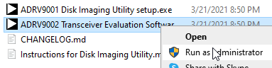
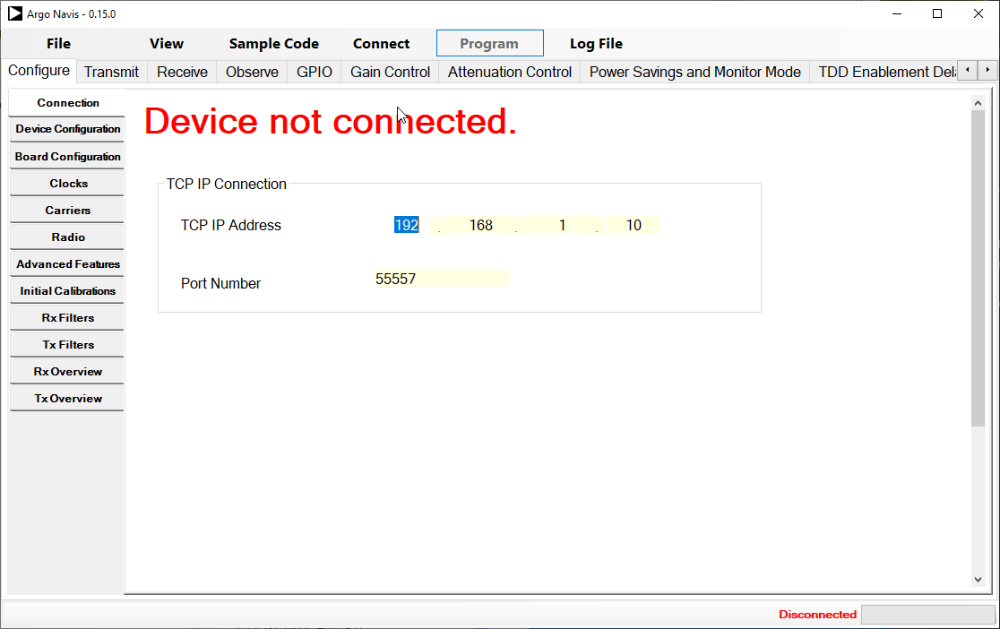

---

# ADI RF Transceiver Evaluation Software HOWTO
This document details what is necessary to install ADI TES and use it to create bit streams and/or profiles to be used on either `BytePipe 3cg9002` or `ZCU102-ADRV9002` boards.

## Table of Contents
- [ADI RF Transceiver Evaluation Software HOWTO](#adi-rf-transceiver-evaluation-software-howto)
  - [Table of Contents](#table-of-contents)
  - [Obtaining TES](#obtaining-tes)
  - [Install TES](#install-tes)
  - [Install SD Card Imaging Utility](#install-sd-card-imaging-utility)
  - [Generating Profile and Stream](#generating-profile-and-stream)

## Obtaining TES
The main webpage fto download TES for various transceivers it [here](https://www.analog.com/en/design-center/landing-pages/001/transceiver-evaluation-software.html).  We are concerned with `ADRV9002` so download [ADRV9001-SDK Evaluation Software (ZIP)](https://www.analog.com/media/en/evaluation-boards-kits/evaluation-software/adrv9001-sdk-eval-software.zip).  

## Install TES
1. Unzip adrv9001-sdk-eval-software.zip to a location of your choice. The resulting directory can be deleted when you are done.
0. Navigate to `adrv9001-sdk-eval-software/adrv9001-sdk/pkg/evaluation`
0. Right click: `ADRV9002 Transceiver Evaluation Software setup.exe` and select .  If you don't a dialog will popup informing you as such.
0. Click through the installer menus.  You can change te *DesitinationFolder* and/or *Start Menu folder* if you like. 
0. Click the __Install__ button
0. When completed you may choose to install a desktop icon.

## Install SD Card Imaging Utility
The TES zip file contains the installer for the ADRV9001 disl imaging utility.  The installer is located in the same directory as the TES installer: `adrv9001-sdk-eval-software/adrv9001-sdk/pkg/evaluation`.  To install follow the steps outlined in `adrv9001-sdk-eval-software/adrv9001-sdk/pkg/evaluation/Instructions for Disk Imaging Utility.md`

##  Generating Profile and Stream
1. Start TES.    You do not need to connect to a board in order to generate the files you desire.
2. Make desired changes to the configuration using the tabs on the left.
3. Generate the profile: Click **Fle -> Generate Profile File**.  A dialog will be presented allowing you to name the file and choose the location.  *Make the name meaningful to others*
4. Generate the stream image: Click **Fle -> Generate Stream Image**.  A dialog will be presented allowing you to name the file and choose the location.  *Make the name meaningful to others*

That's it.  You know have the files necessary to alter a running devices configuration. 