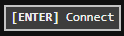
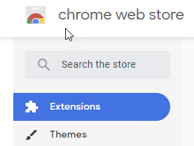
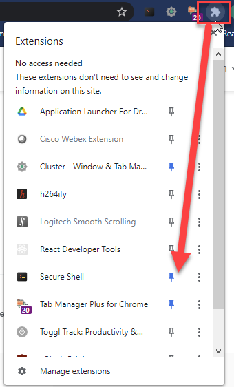
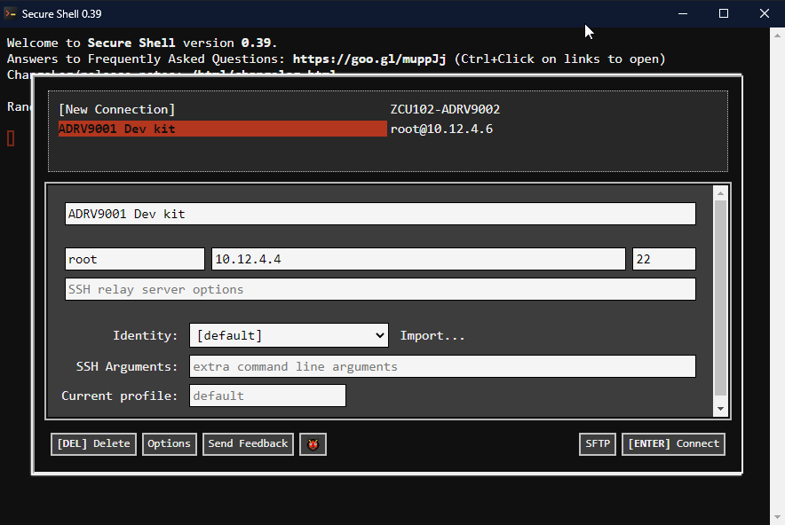

---

# IIO-Oscilloscope Streams and Profiles
ADI online instructions will guide one to use IIO-Oscilloscope SW to update a device profile and stream.  As of March 20, 2021 IIO-Oscilloscope - v0.14-master version will fail to load either the profile or the stream.  An investigation, looking at `dmesg`, does not detail and apparent issue on the device side.  It is thought the issue is with the IIO-Oscilloscope v0.14 SW itself.  Therefore, to updating the profile and stream is done on the device itself using the command line.

*The following instructions assume your machine (Linux or Windows) is on the same network as either ZCU102-ARDV9002 or BytePipe 3cg 9002.*

## Table of Contents
- [IIO-Oscilloscope Streams and Profiles](#iio-oscilloscope-streams-and-profiles)
  - [Table of Contents](#table-of-contents)
- [Special Note](#special-note)
- [Update Device Profile and Stream](#update-device-profile-and-stream)
- [Acquiring Device Log](#acquiring-device-log)
- [SSH Client](#ssh-client)
  - [Secure Shell Chrome Extension](#secure-shell-chrome-extension)
    - [Creating a connection to the board](#creating-a-connection-to-the-board)

---

# Special Note

For ZCU102-ADRV9002 there are some bugs in the 2019_r1 build.  You must used the pre-release version provided by [ADI](https://github.com/analogdevicesinc/hdl/releases/tag/hdl_2019_r2).  
  

If ZCU102-ADRV9002 is revision `B0`, the SD card files  `BOOT.bin` and `system.dtb` MUST be replaced with the files from [here](http://swdownloads.analog.com/cse/tmp/B0_2019_r2_pre_release_zcu102.zip).  Replace the SD card `Image` with [this one](https://ez.analog.com/cfs-file/__key/communityserver-discussions-components-files/323/Image.zip).  Furthermore, if the FPGA is configured for LVDS instead of CMOS use `BOOT.bin` and `system.dtb` from [this](https://ez.analog.com/cfs-file/__key/communityserver-discussions-components-files/323/8662.system.zip). 
  

**All** of the above build manipulation/tweaking has been done and is available in the repo under [`builds/iioscope/adi_hdl_2019_r2/`](http://ngrf.poweredbyclear.com:3000/NGRF/IIO-Oscilloscope/src/master/builds/iooscope/adi_hdl_2019_r2/hdl_2019_r2.7z).  Simply download this, decompress it, and install it on your SD card. 

---

# Update Device Profile and Stream
As previously mentioned, IIO-Oscilloscope UI application fails to load profiles and streams.  Until more time is spent to determine the root cause, the following process may be used.

Assumptions:  
- Profile:  `lteDefault_adrv9002.json`
- Stream:  `lteDefault_adrv9002.bin`
- Device: `/sys/bus/iio/devices/iio:device1` (this appears to be true for ZCU102-ADRV9002 kit)
- SCP Client:  PuTTY-`PSCP`
- Device IP: `10.12.4.4`

1. On the machine in which the files were generate, open a terminal in the directory of the file.
2. Copy the files to the device: (you will be prompted for root password, it is `analog`)
    - `pscp -P 22 lteDefault_adrv9002.json root@10.12.4.4:/root/`
    - `pscp -P 22 lteDefault_adrv9002.bin root@10.12.4.4:/root/`
3. SSH into the device using Secure Shell Chrome extension and the connection created in section [Creating a connection to the board](#creating-a-connection-to-the-board) 
    -  Click `Connect`  or just hit Enter
    -  If this is the first time you have connected you will be prompted to save the remote (device) fingerprint, enter `yes`
    -  When prompted enter root password: `analog`
4. Verify the files are present by issuing `ls` on the command line.  You should see the two files you transferred
5. Load/apply the stream and profile
    - Stream: `cat lteDefault_adrv9002.bin > /sys/bus/iio/devices/iio:device1/stream_config`
    - Profile: `cat lteDefault_adrv9002.json > /sys/bus/iio/devices/iio:device1/profile_config`
    
    
There should be no error displayed when running the two `cat` commands.  If there is an error the log from the device needs to be extracted.  The file should be shared with appropriate NGRF representative and/or open a support ticket with ADI.

#  Acquiring Device Log
There is not a dedicated log for IIO-Oscilloscope running on the device.  ADI has chosen to dump message to `dmesg`.  To get a copy of `dmesg` content run this command from your home directory (i.e. /root or /home/analog): `dmesg > <sometingMeaninful>_dmesg.txt`.  Now the file needs to be transferred to your machine.  Assuming Windows, perform the following.

1. Open a terminal in a folder of your choice
2. Copy the remote file:  `pscp -P 22 root@10.12.4.4:/root/<sometingMeaninful>_dmesg.txt ./.`.  Enter the password when prompted; the file should be transferred.

---

# SSH Client
There is a Chrome extension which provides a very nice SSH client.  Ultimately it is up to you what SSH client SW you want to use, PuTTY, Tera Term, etc.  The following are the steps to install the Chrome extension.

## Secure Shell Chrome Extension
This client is preferred as it provides a nice interface and makes copying from the terminal a breeze.  To copy text from the remote terminal merely select the text and Secure Shell will take care of the copying and inform you as such.

1. Open Chrome
2. Go [here](https://chrome.google.com/webstore/category/extensions?hl=en)
3. Enter `secure shell` in the  
4. Select  
5. Click **Add to Chrome** button and allow it to install

The new extension should show up to the right of the address bar .  If it doesn't appear click the puzzle looking icon and click the **pin** next to Secure Shell .

### Creating a connection to the board
This procedure should only need to be done once **unless** the IP address of the board changes.

1. Click the Secure Shell icon in Chrome 
2. Select **Connection Dialog** 
3. Select `[New Connection]`
4. Create an entry like shown in step 2, entering the correct IP address of the board.

