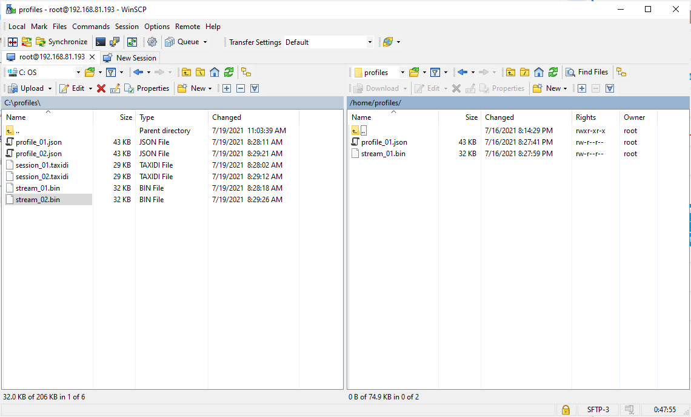

---
# Device Profile

The radio is configured by a profile which contains all the appropriate settings and configuration steps to successfully setup the radio.  Profiles can be generated using the Transceiver Evaluation Software (TES) from Analog Devices.  The TES software allows users to create their own profiles which can be exported and then loaded into the device using IIO-Oscilloscope.  Along with the profile is a stream configuration.  The stream configuration provides the appropriate settings to the stream processor running inside the RFIC.  These instructions assume the BytePipe_x9002 with the ADRV9002 RFIC is being used however the process is the same for other NextGenRF Design platforms.  

## Generating Profile

To generate a profile the appropriate TES software must be downloaded and installed.  For the BytePipe_x9002 the [ADRV9001-SDK Evaluation Software](https://www.analog.com/en/design-center/landing-pages/001/transceiver-evaluation-software.html) should be used.  Once downloaded install the software located in the `pkg\evaluation` folder.  Make sure to install as administrator.  For additional information refer to the [User Guide](https://www.analog.com/media/en/technical-documentation/user-guides/adrv9001-system-development-user-guide-ug-1828.pdf).  

Once the appropriate version of TES is installed the user can select the appropriate settings by using the `Configure` tab.  Under the `Configure` tab are several additional tabs for configuring the device, board, clocks, etc.  Once the desired settings are configured the profile and stream can be exported by navigating to `File->Generate Profile File` and `File->Generate Stream Image`.  These files can then be used with IIO-Oscilloscope to update the devices configuration.  It is often useful to save the session for future reference.  This allows the user to load the session in the future to determine the setup of the corresponding profile.  The session can be saved by navigating to `File->Save Session`.  

For the purpose of this demonstration a profile was setup with Rx1B and Rx2B enabled and both transmitters disabled.  The profile, stream, and session files were saved as `profile_02.json`, `profile_02.bin`, and `profile_02.taxidi`.  


## Pre-generated Profiles

For convenience several pre-generated profiles are included with this repository.  These are described below.

| Profile         | Stream        | Session           | Description                                |
|-----------------|---------------|-------------------|--------------------------------------------|
| profile_01.json | stream_01.bin | session_01.taxidi | Rx1A, Rx2A: 25.6MSPS                       | 
| profile_02.json | stream_02.bin | session_02.taxidi | Rx1B, Rx2B: 25.6MSPS                       | 

## Updating Device Profile - GUI

There are two ways to update the device profile.  The first method uses the IIO-Oscilloscope GUI shown below.  This method allows the user to browse to the saved profile and stream image and update the device.  As of this writing the latest version [(v0.14)](https://github.com/analogdevicesinc/iio-oscilloscope/releases/tag/v0.14-master) of IIO-Oscilloscope GUI application fails to load profiles and streams for the ADRV9002.  This is thought to be an issue with the GUI itself.   


## Updating Device Profile - SCP/SSH

An alternative method for updating the device profile copies the profile and stream files to the device and then applies them to the appropriate iio device. 

### Copying Device Profile

This example shows how to copy the generated profile and stream files from a linux host machine to the device using a secure copy client such as `pscp`.  When prompted for a password enter `analog`.  

```bash
pscp -P 22 ~/iio-oscilloscope/profiles/profile_01.json root@192.168.81.193:/home/profiles/
pscp -P 22 ~/iio-oscilloscope/profiles/stream_01.bin root@192.168.81.193:/home/profiles/
```

Similar commands can be used on a Windows machine using cygwin as shown below:

```bash
scp -P 22 stream_01.bin root@192.168.81.193:/home/profiles/
scp -P 22 profile_01.json root@192.168.81.193:/home/profiles/
```

An alternative to copying with bash commands is to use [WinSCP](https://winscp.net/download/WinSCP-5.19.1-Setup.exe).  This can be downloaded onto a Windows machine and used to copy files to the device.  To use WinSCP first connect as shown below.  Replace the ip address with the ip address of your device.  The password is `root`. Once connected the files can be copied to and from the appropriate folders.




The SD card can also be used to copy profiles to the device.  The released SD card image has several pre-loaded profiles located at `/home/profiles/` on the device.  Additional profiles can be copied to this folder by inserting the SD card into a linux machine and copying the files to this folder.

### Applying Device Profile

Once the profile and stream files are copied to the device they must be applied to the appropriate IIO device driver.  This must be done from the command line of the device.  The device command line can be connected using SSH or via the serial port.  To connect to the serial port simply connect the USB serial port to a PC and open a terminal using a COM port with 115200 8n1 settings.  To connect via SSH enter the following bash commands from a linux bash terminal.  The appropriate ip address of your device should be used with `root` as the username and when prompted use the password `analog`.

```bash
ssh root@192.168.81.193
```

Once connected to the devices command line the appropriate profile and stream files should be copied to `iio:device1`.  This is shown below.  The stream image should be copied before the profile.  Once copied the device will automatically load the new profile settings.


```bash
cat /home/profiles/stream_01.bin > /sys/bus/iio/devices/iio:device1/stream_config
cat /home/profiles/profile_01.json > /sys/bus/iio/devices/iio:device1/profile_config
```

**Note:** Often re-connecting to the device from IIO-Oscilloscope is advisable to make sure the new settings are applied.  In addition many of the profiles will load with the IIO devices with the ENSM set to `calibrated`.  To enable the corresponding functionality change the ENSM to `rf_enabled` using the IIO-Oscilloscope GUI controls panel.  

Additional information regarding the loading ADRV9002 profiles can be found [here](https://wiki.analog.com/resources/tools-software/linux-drivers/iio-transceiver/adrv9002#profiles).  


