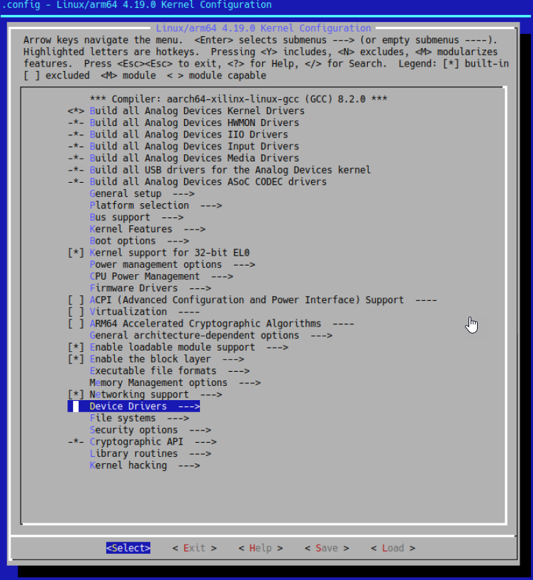
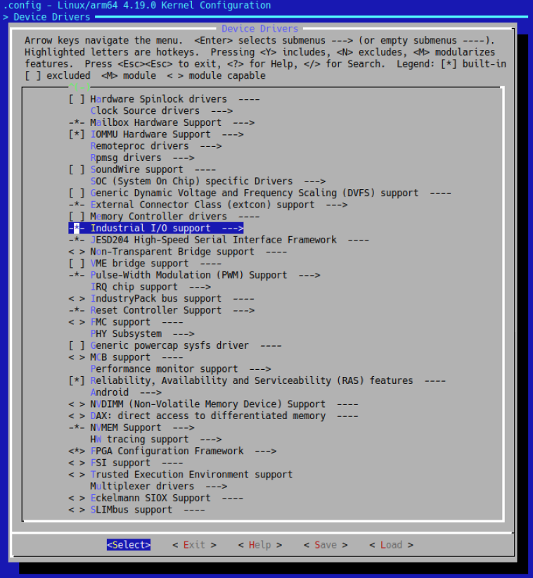
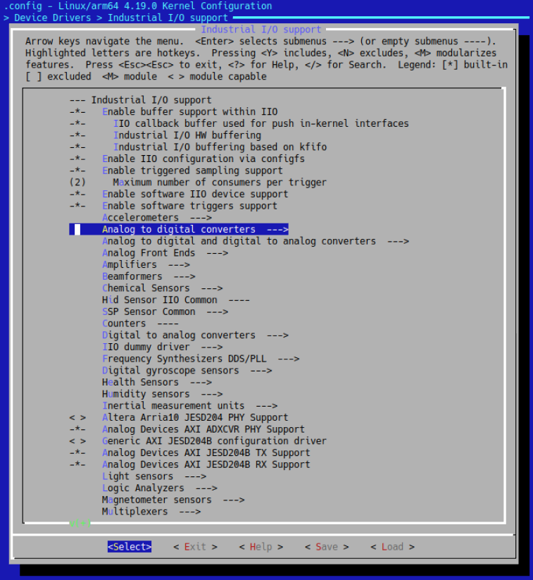
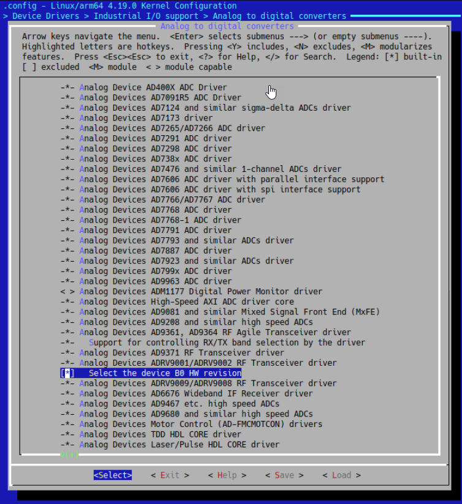

---

# ZCU102-ADRV9002 IIO-Oscilloscope Build
This document details the building of linux including the ADI libiio drivers for the [ZCU102-ADRV9002 development kit.](https://www.xilinx.com/products/boards-and-kits/ek-u1-zcu102-g.html).  More information about the ADI Yocoto layer can be found [here](https://github.com/analogdevicesinc/meta-adi/tree/master/meta-adi-xilinx).


## Table of Contents
- [ZCU102-ADRV9002 IIO-Oscilloscope Build](#zcu102-adrv9002-iio-oscilloscope-build)
  - [Table of Contents](#table-of-contents)
- [Performing the Build](#performing-the-build)
  - [Build Prerequisites](#build-prerequisites)
  - [(1) Create a workspace in your home directory](#1-create-a-workspace-in-your-home-directory)
  - [(2) Get NGRF's HDL](#2-get-ngrfs-hdl)
  - [(3) Prepare for PetaLinux build (Step 1)](#3-prepare-for-petalinux-build-step-1)
    - [PetaLinux Project `menuconfig`](#petalinux-project-menuconfig)
    - [User Layer 0](#user-layer-0)
    - [User Layer 1](#user-layer-1)
      - [Sample output](#sample-output)
  - [(4) Prepare for PetaLinux build (Step 2)](#4-prepare-for-petalinux-build-step-2)
  - [(5) B0 Hardware Rev Only Prepare for PetaLinux build (Step 2a)](#5-b0-hardware-rev-only-prepare-for-petalinux-build-step-2a)
  - [(6) Build the Kernel](#6-build-the-kernel)


# Performing the Build

## Build Prerequisites
- PetaLinux installed; if not please start [here](../docs/PetaLinuxInstall.md).  
- Xilinx Vivado installed
- Access and permissions, to NextGen RF's HDL git [repository](http://ngrf.poweredbyclear.com:3000/NGRF/hdl.git).

## (1) Create a workspace in your home directory
```java
mkdir -p ~/workspace
```

## (2) Get NGRF's HDL
With a stable and correctly build NGRF HDL, the HDL build step can be skipped.  Furthermore, installation of Vivado is not necessary.

```java
cd ~/workspace
git clone http://ngrf.poweredbyclear.com:3000/NGRF/hdl.git
```

## (3) Prepare for PetaLinux build (Step 1)
In this step we prepare our shell environment, get ADI's device based plarform layers, create our PetaLinux project, and configure our PetaLinux project.

```java
cd ~/workspace
source ~/petalinux/settings.sh
git clone --branch 2019_R2 https://github.com/analogdevicesinc/meta-adi.git
petalinux-create -t project --template zynqMP --name iiioscope
cp hdl/projects/iio/zcu102-adrv9002/system.hdf ./.
cd iiioscope/
petalinux-config --get-hw-description=~/workspace/
```

### PetaLinux Project `menuconfig`
**_When running petalinux-config, a configuration menu will come up. Go to Yocto Settings→User layers and add the following shown below._**

**_Since meta-adi-xilinx depends on meta-adi-core, it has to be included after meta-adi-core. The order is important!_**


### User Layer 0
`~/workspace/meta-adi/meta-adi-core`

### User Layer 1
`~/workspace/meta-adi/meta-adi-xilinx`


Use the arrow keys to select `Save` and press the enter key.  A popup will be displayed informing where the settings will be saved; select `Ok` and press the enter key.  Then keep selecting `Exit` (and press the enter key) until you exit the menuconfig.  PetaLinx will proceed to create the configuration; this will take a while.

#### Sample output
```java
ngrf@ubuntu:~/workspace/iiioscope$ petalinux-config --get-hw-description=~/workspace/
INFO: Getting hardware description...
[INFO] generating Kconfig for project
[INFO] menuconfig project


*** End of the configuration.
*** Execute 'make' to start the build or try 'make help'.

[INFO] sourcing bitbake
[INFO] generating plnxtool conf
[INFO] generating meta-plnx-generated layer
[INFO] generating user layers
[INFO] generating workspace directory
[INFO] generating machine configuration
[INFO] generating bbappends for project . This may take time ! 
[INFO] generating u-boot configuration files
[INFO] generating kernel configuration files
[INFO] generating kconfig for Rootfs
[INFO] silentconfig rootfs
[INFO] generating petalinux-user-image.bb
```

## (4) Prepare for PetaLinux build (Step 2)
Next update the configuration file to build with the correct device tree.

```java
echo "KERNEL_DTB=\"zynqmp-zcu102-rev10-adrv9002\"" >> project-spec/meta-user/conf/petalinuxbsp.conf
```

The .conf file should contain this 

```c
 #User Configuration
 
 #OE_TERMINAL = "tmux"
 
 # Add EXTRA_IMAGEDEPENDS default components
 EXTRA_IMAGEDEPENDS_append = " virtual/fsbl virtual/pmu-firmware arm-trusted-firmware qemu-devicetrees"
 
 # prevent U-Boot from deploying the boot.bin
 SPL_BINARY = ""
 
 #Remove all qemu contents
 IMAGE_CLASSES_remove = "image-types-xilinx-qemu qemuboot-xilinx"
 IMAGE_FSTYPES_remove = "wic.qemu-sd"
 
 EXTRA_IMAGEDEPENDS_remove = "qemu-helper-native virtual/boot-bin"
 KERNEL_DTB="zynqmp-zcu102-rev10-adrv9002"
 ```

## (5) B0 Hardware Rev Only Prepare for PetaLinux build (Step 2a)
If the ZCU102-ADRV9002 kit is rev `B0`, the kernel needs to be configured as such.  _Note it may take a while before the config menu appears_.

```java
petalinux-config -c kernel
```
Navigate through the meun to get to ADCs page, then select `Select the device B0 HW revision`






## (6) Build the Kernel
With the configuration as desired the kernel may now be built with the following command.

```java
petalinux-build
```